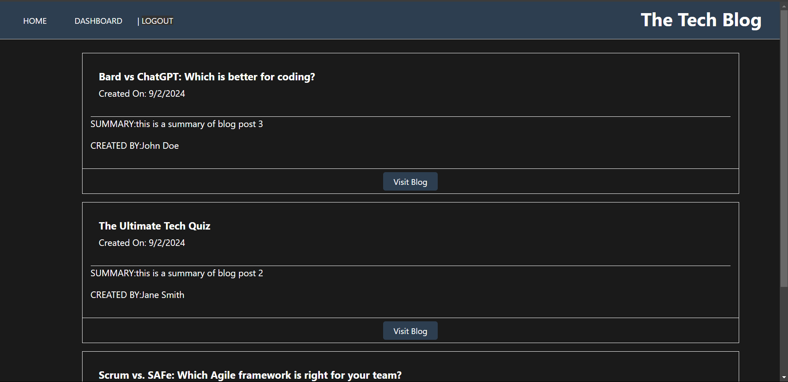
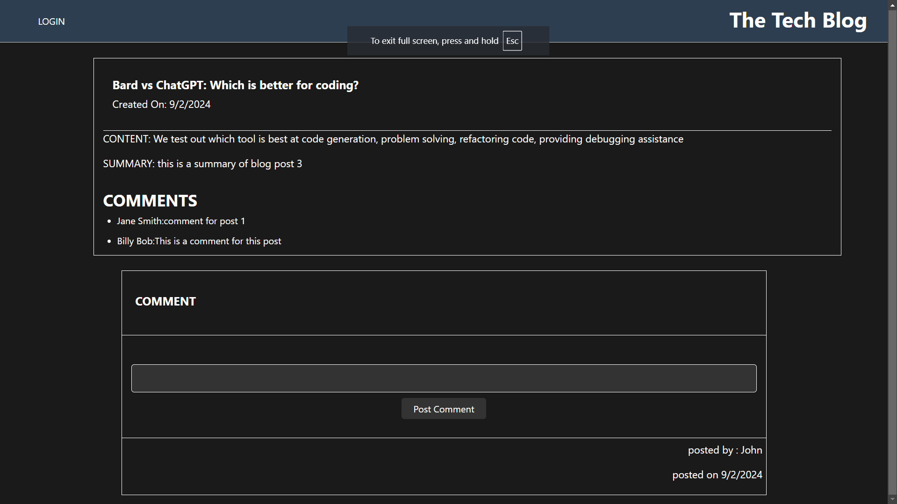
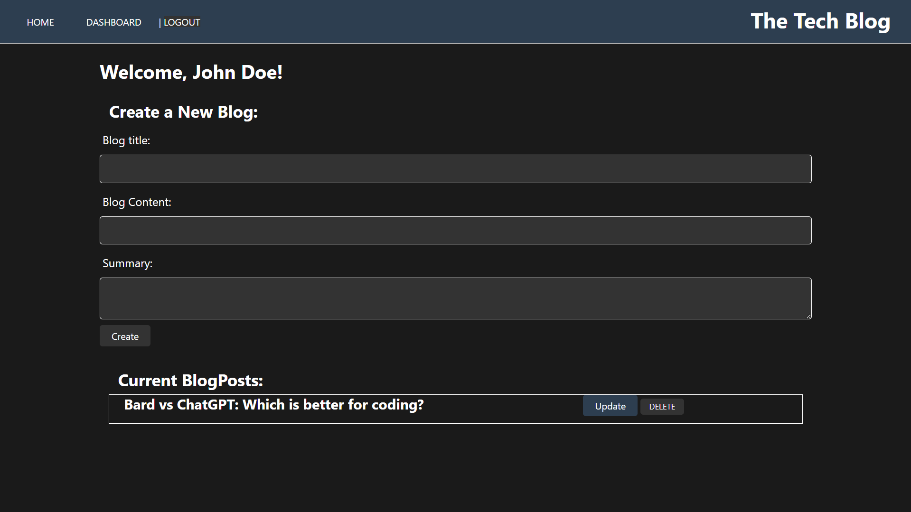

# Tech-Blog-website
Tech Blog Website MVC Architecture

## Description
This is an blogging website based on Node and Express.js API and configured with Sequelize to interact with a MySQL database.

## Live Link
[Tech Blogs](https://tech-blog-website-775s.onrender.com)

## User Story
AS A developer who writes about tech
 
I WANT a CMS-style blog sit
 
SO THAT I can publish articles, blog posts, and my thoughts and opinions

## Installation

 Install the following:
  
 npm install express
  
 npm install sequelize, mysql12, dotenv

 ## Preview
 

 

 

 ## License

 

 This project is licensed under the [MIT License](https://choosealicense.com/licenses/mit/) license.

 ## Contributing

 Pull requests are welcome

 ## Queries

 GitHub: https://github.com/AceSpadee